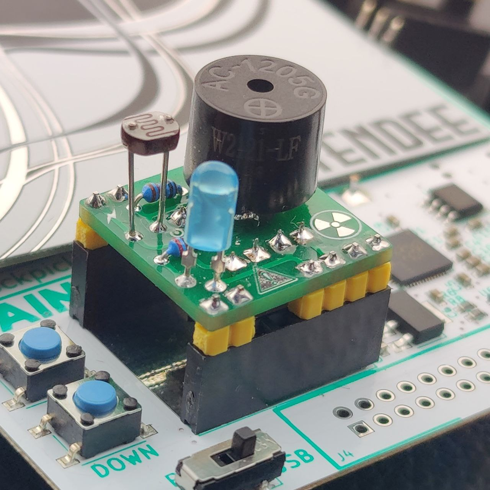
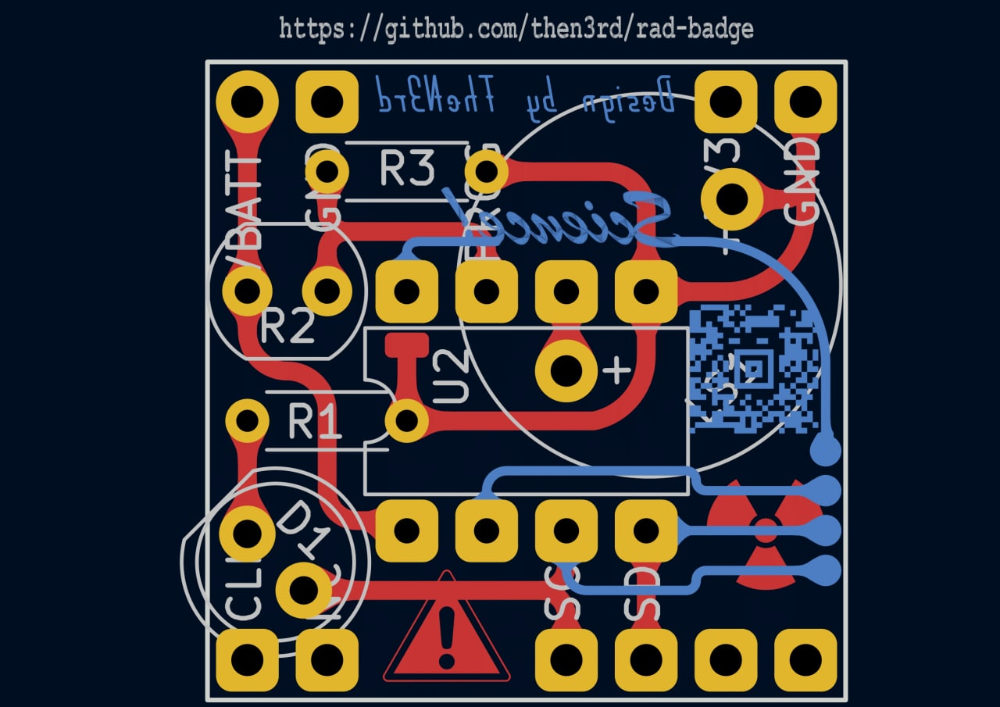
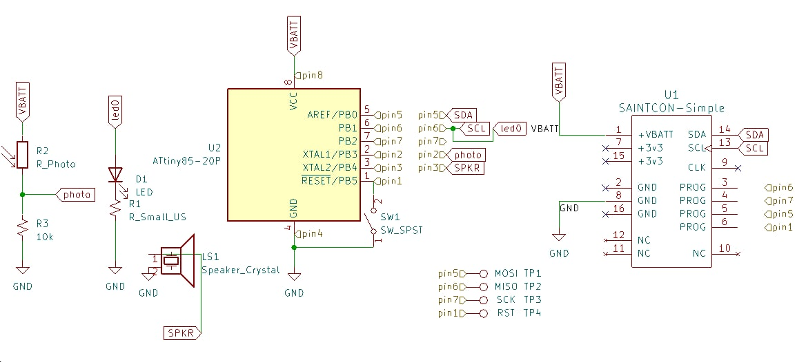

# Radiation Minibadge 2022

### Version 1.0

PCB

Schematic

## IDE & Settings
First, install [VSCode](https://code.visualstudio.com/download) and install the [platform.io](https://marketplace.visualstudio.com/items?itemName=platformio.platformio-ide) extension.

Debugging over serial and other configurable values can enabled and adjusted in `settings.h`

## Fuses & Firmware
To allow the Attiny85 to run at 16MHz instead of the factory 8MHz we need to set some custom "fuses" on the chip. This is only neccesary one time as the fuses are set until modified, regardless of new firmware.

The current platformio.ini is confiugred for the USBasp programmer but you can configure your own too.
1. Open this project with VSCode, Click the PlatformIO (alien) button.
2. Expand "attiny85-usbasp" -> "Platform" and click "Set Fuses".

If your programmer is correctly connected, the fuses will have been set and you'll see no errors in the conosle.

Alternatively `pio run --target fuses --environment attiny85-usbasp` may work

Next we can build and write the code:
1. Click "attiny85-usbasp"  -> "General" and click "Build". If there are no errors in the code, it will build.
2. Click "Upload". If the attiny is corrrectly connected the firmware will be written and validated.

## MIDI setup
Midi songs can be converted to bytecode and flashed to the device.
* Check out https://musicboxmaniacs.com/ for compatible midis
`
To convert your song use the linux xxd utility:

`xxd -i yoursong.midi > midi/yoursong.h`

Next, modify the include line in `midiplay.h` to include your song

`#include "midi/yoursong.h"`

Re-flash your chip and enjoy.

## Useful Resources & References

* https://cyberblogspot.com/how-to-program-attiny85-with-arduino-ide/
* https://riteshkhanna.com/2016/04/20/programming-attiny45attiny85-with-a-usbasp-avr-programmer/
* https://hackaday.io/project/159973-z80-mbc2-a-4-ics-homebrew-z80-computer/log/150087-how-use-the-icsp-port-with-the-usbasp-programmer-under-linux-to-burn-the-bootloader
* https://wolles-elektronikkiste.de/en/programming-attiny-with-arduino-code
* https://quadmeup.com/attiny85-light-sensor-i2c-slave-device/
* https://www.mouser.com/datasheet/2/268/Atmel_2586_AVR_8_bit_Microcontroller_ATtiny25_ATti-1315542.pdf
* https://github.com/lukejenkins/minibadge
* https://saintcon.org/wp-content/uploads/2021/10/MINIBADGE-Guide-2021.pdf

### TODO:
* Light-pulse programmable MIDI's from phone or terminal
    https://github.com/SaadOjo/DIY_Li-Fi/blob/master/transmitter/transmitter.ino
    https://github.com/SaadOjo/DIY_Li-Fi/blob/master/receiver/receiver.ino
* Profit???